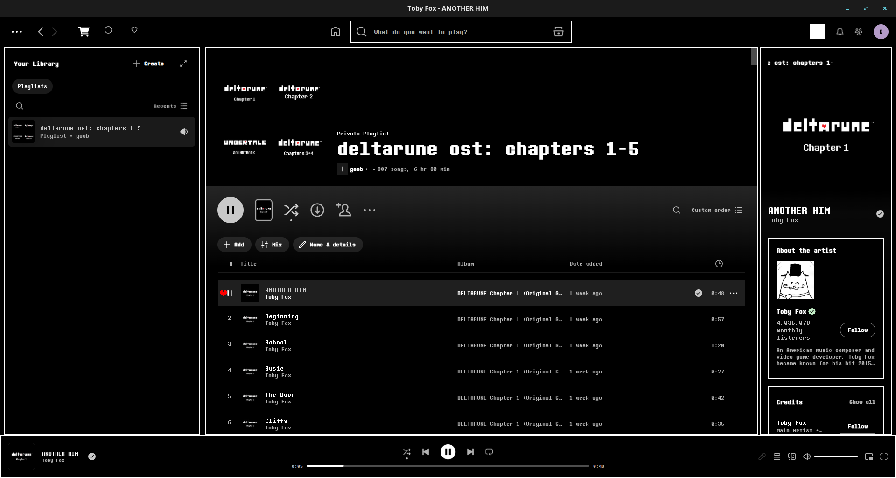

# Determination

An Undertale-inspired black-and-white theme for [Spicetify](https://spicetify.app).

Pure-black UI, white text-box borders with hard pixel corners, the Determination
Mono typeface everywhere, and the red Soul as the mouse cursor and the playback
progress handle. A menu select sound plays on clicks, but only while music is
stopped, so it never layers over playback.



## Features

- Determination Mono font across the entire client
- Pure-black background with white, sharp-cornered text-box borders on panels, cards, and menus
- Red Soul cursor and red Soul progress handle that rides the playback position
- Soul marker on hovered track rows; white selection bar on hovered nav, library, and context-menu rows
- Squared corners on cover art, avatars, buttons, and inputs for a consistent pixel-era look
- Neutralized header tint and a whitened now-playing equalizer, so the only color anywhere is the red Soul
- Bundled select-sound extension, gated to fire only when nothing is playing

## Install

### Via Marketplace

Open the Marketplace custom app in Spotify, search **Determination** under
Themes, and install. The select sound is bundled and loads with the theme.

### Manual

Clone into the Spicetify Themes folder:

```
git clone https://github.com/KaiFlufftail/Determination.git \
  "$(spicetify -c | xargs dirname)/Themes/Determination"
```

Copy `select-sound.js` into the Extensions folder, then point Spicetify at
everything and apply:

```
spicetify config current_theme Determination color_scheme Determination
spicetify config inject_css 1 replace_colors 1
spicetify config extensions select-sound.js
spicetify apply
```

## Credits

Undertale and its assets are the work of Toby Fox. The heart and
sprites and the select sound are ripped from the game; the Determination Mono
font is a community recreation. This theme is unofficial fan work and is not
affiliated with or endorsed by Toby Fox.
